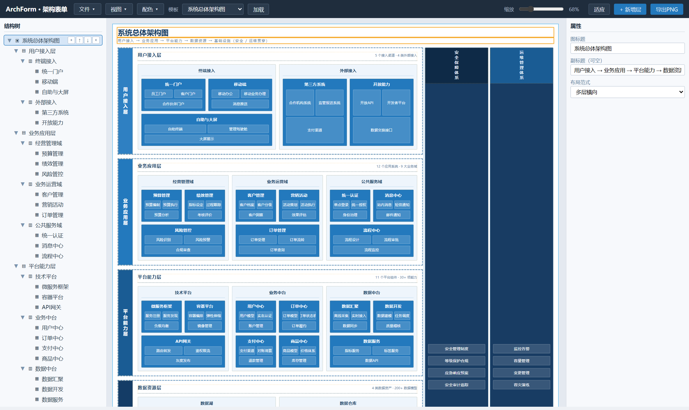
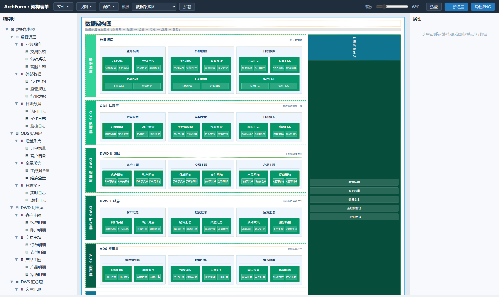
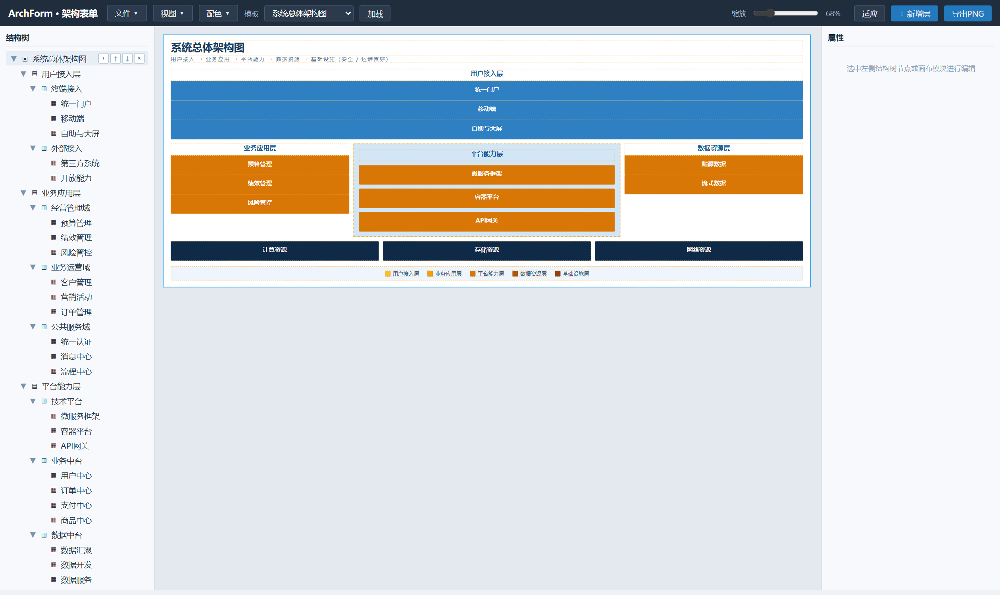
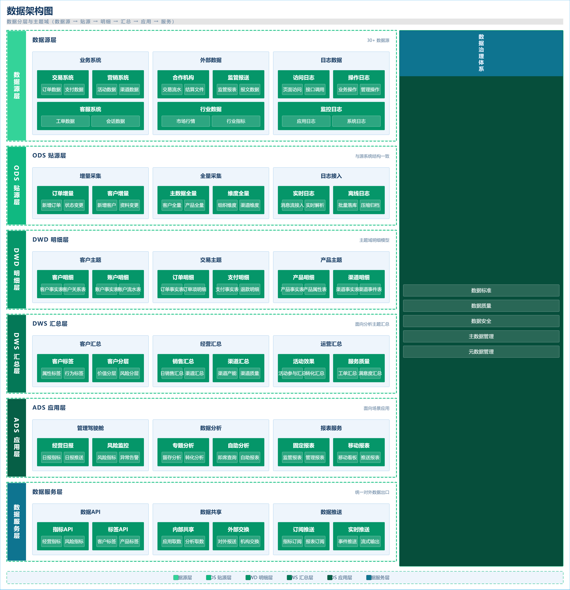

# ArchForm · 架构表单

**把画框图变成填表单。**

[English](README.md) | **简体中文**

[](LICENSE)
[](#)
[](#)

> ArchForm 是一个零依赖、完全离线的**结构化框图**编辑器:分层架构图(总体架构 / 应用架构 / 数据架构 / 技术架构)通过编辑数据树自动排版,而不是在画布上手工拉框——结果一致、可直接评审、可版本管理。
>
> 分层架构图是**结构化数据**,不是自由画布——自由曲线绘制场景不在范围内(见 [设计边界](docs/ROADMAP.md))。

## 预览

| | |
|---|---|
| 总体架构 · 分层板式 · 经典蓝 | 数据架构 · 分层板式 · 青绿配色 |
|  |  |
| 中央核心板式 · 暖橙配色 | 纯净 PNG 导出(独立产物,含当前配色) |
|  |  |

## 为什么不是又一个画布工具?

分层架构图 90% 是"层 → 分组 → 模块 → 条目"的嵌套结构,不是自由拓扑。画布工具(draw.io / Visio / ProcessOn)强迫你手工拉框、对齐、调间距——精力花在"摆"而不是"想"。ArchForm 用**结构化输入 → 自动排版 → 规范固化**解决这个问题,并让架构图数据可 diff、可版本管理、可复用。

## 特性

- **结构化输入**:编辑四级结构树(图 → 层 → 分组 → 模块 → 条目);树底部快速录入栏用 Enter / Tab / Shift+Tab 直接打字建节点,右键菜单支持 新建 / 复制 / 粘贴 / 上移 / 下移 / 删除
- **撤销 / 重做**:50 步历史,覆盖所有编辑(结构、属性、配色、模板加载),Ctrl+Z / Ctrl+Shift+Z
- **自动排版**:同一份内容在 3 种板式间切换,数据不丢失——多层横向、中央核心、卡片网格
- **规范固化**:虚线面板、圆角 2px、字号层级;6 套预置配色 + 自定义六档色阶,随图保存(含右侧通栏竖条)
- **评审友好的辅助区**:底部图例通栏、右侧体系通栏(安全/运维/治理等贯穿性体系)
- **从文本生成图**:文件 →「从文本生成图…」,缩进文本一键生成整图,实时结构预览
- **复制粘贴结构**:任意 层/分组/模块 深拷贝(Ctrl+C / Ctrl+V),副本保持原结构、生成全新 ID,按目标位置智能插入(同层=兄弟、容器=子级)
- **统计自动计算**:每层自动显示"X 分组 · Y 模块 · Z 条目"(可逐层开关)
- **完全离线**:导出矢量 **SVG**、高清 **PNG**(2 倍)、独立 **HTML**(内嵌矢量数据);零网络请求、零运行时依赖,`file://` 双击即用
- **数据版本化**:图数据带 `schemaVersion`,加载时自动迁移(`migrateDiagram`);JSON 导入导出 + localStorage 自动保存
- **5 个内置模板**:通用分层 / 总体架构 / 应用架构 / 数据架构(数仓分层)/ 技术架构

## 快速开始

```bash
git clone https://github.com/Lincoln-cn/archform.git
cd archform
# 无需安装、无需服务器、无需网络,直接打开:
start index.html        # Windows
open index.html         # macOS / Linux
```

支持 `file://` 直接打开。

### 部署到 GitHub Pages 在线使用

仓库已为 GitHub Pages 就绪(所有资源引用均为相对路径):

1. 推送仓库到 GitHub 后,进入 **Settings → Pages**,将发布源设为 `master` 分支(根目录 `/`)。
2. 在线版本地址为 `https://<user>.github.io/archform/`(已含 `.nojekyll`,静态托管行为可控)。
3. 任意浏览器打开即可使用,无需后端。注意:`localStorage` 自动保存按"访问地址 + 浏览器"隔离,在线副本与本机文件互不相通——跨环境迁移图用「导出JSON / 导入JSON」。

不想用 GitHub 时,把整个目录丢到任意静态站点或内网共享即可,`index.html` 是入口。

## 模板

| 模板 | 板式 | 适用场景 |
|---|---|---|
| 通用分层架构 | 多层横向 | 通用分层参考(能力上限演示) |
| 系统总体架构图 | 多层横向 | 用户 → 应用 → 平台 → 数据 → 基础设施,安全/运维贯穿 |
| 应用架构图 | 多层横向 | 应用系统及其功能模块划分 |
| 数据架构图 | 多层横向 | 数据源 → ODS → DWD → DWS → ADS → 数据服务,按主题域 |
| 技术架构图 | 多层横向 | 接入 → 服务 → 中间件 → 存储 → 基础设施 |

模板是 `templates.js` 里的纯数据——复制 JSON 结构即可新增自己的模板。

## 导出

| 格式 | 说明 |
|---|---|
| **SVG** | 矢量图,无损缩放,可继续编辑(文件 → 导出SVG) |
| **PNG** | 整图 2 倍高清位图,含当前配色(工具栏 导出PNG) |
| **HTML** | 独立文件,含完整样式与内嵌矢量数据;可插入文档,内部仍可下载 PNG |
| **JSON** | 图数据本身——可版本管理、可 diff、可跨项目复用 |

## 目录结构

```
.
├─ index.html           # 编辑器骨架(内联样式规范 + 页面;双击即用)
├─ editor-core.js       # 状态、节点查找、数据版本化(migrateDiagram)
├─ editor-tree.js       # 结构树:渲染、节点操作、快速录入、复制粘贴、右键菜单
├─ editor-render.js     # 渲染引擎:多层横向 / 中央核心 / 卡片网格
├─ editor-ui.js         # 属性面板、配色、导出(SVG/PNG/HTML)、缩放、事件
├─ templates.js         # 内置模板库(纯数据)
├─ docs/                # 对外文档(版本规划、使用指南)
└─ LICENSE              # Apache-2.0
```

## 文档

- [docs/ROADMAP.md](docs/ROADMAP.md) — 版本规划、痛点背景、**设计边界**(连线策略、数据兼容承诺)
- [docs/usage.md](docs/usage.md) — 详细使用指南(中文)

## 贡献

- **模板**:在 `templates.js` 中加纯 JSON 数据,直接提 PR——无构建步骤
- **Bug / 需求**:提 issue(注明是模板请求还是编辑器问题)
- 较大改动前请先阅读 [docs/ROADMAP.md](docs/ROADMAP.md) 中的版本规划与设计边界

## 许可

[Apache-2.0](LICENSE) © 2026 ArchForm Contributors
